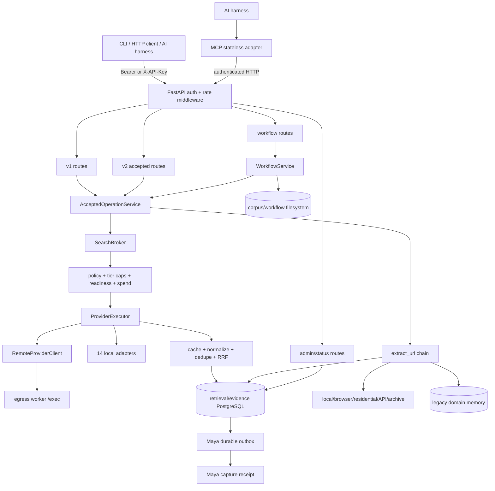

# Argus System Topology and Contract Map

**Source baseline:** deep audit begun at `be5b5a8559816b1a142d043e3461639056a4d694` and refreshed after integrating runtime source `6c0129ee93ee6edf5f61076dfdeaa9c55fd09089` on 2026-08-31. The publication descendant changes documentation only. This map is source evidence, not proof that the same commit is deployed.

## 1. System Role and Authority Boundary

Argus has two materially different modes:

1. **Production authority:** one authenticated FastAPI HTTP service owns provider credentials, broker execution, PostgreSQL evidence, budgets, readiness, sessions, extraction, outbox delivery, and workflow execution; workflow run/artifact persistence itself is node-local filesystem state.
2. **Adapters/development:** MCP and production CLI are stateless HTTP clients. Direct Python brokerage, standalone MCP, workers, SQLite, legacy persistence, and local browser execution are development/compatibility surfaces.

The canonical deployed topology documented in `docs/operations.md` is Homelab Docker:

```text
AI harness / script / service
        |
        | MCP or authenticated HTTPS
        v
MCP adapter :8271/8001 ----------+
                                  |
CLI HTTP adapter ----------------+--> FastAPI authority :8270/8000
                                       |
                                       +--> SearchBroker
                                       |     +--> local provider adapters
                                       |     +--> optional remote egress worker /exec
                                       |     +--> cache, dedupe, RRF ranking
                                       |
                                       +--> Extraction chain
                                       |     +--> local/browser/residential/API/archive
                                       |
                                       +--> WorkflowService
                                       |     +--> accepted search/extract/acquire-site
                                       |     +--> filesystem corpus/run artifacts
                                       |
                                       +--> PostgreSQL authority
                                       |     +--> retrieval/evidence/session rows
                                       |     +--> spend/readiness/outbox rows
                                       |
                                       +--> Maya capture outbox --> Maya receipt
```

## 2. Repository and Module Inventory

### Top-level directories

| Path | Purpose | Runtime relevance |
|---|---|---|
| `argus/` | Installable Python package and all service code | Active |
| `tests/` | Unit, integration, contract, concurrency, PostgreSQL, distribution, and deployment tests | Active; 2,672 passed / 43 skipped after runtime-source integration |
| `migrations/` | Alembic environment and revisions 0001–0009 | Active; autogeneration metadata is incomplete |
| `ops/postgres/` | Shared-cluster role/ACL provisioning SQL | Active in CI/operator flow |
| `docker/`, `Dockerfile`, `docker-compose.yml` | Production image, browser security profile, local composition | Active |
| `scripts/` | Diagnostics, scorecards, release checks, MCP/server wrappers, systemd installation | Mixed active and legacy |
| `deploy/` | Historical launchd plists and start scripts | Superseded but still executable |
| `.github/workflows/` | CI, scorecard, immutable image, and publishing automation | Active |
| `docs/` | Operations, ADRs, research, scorecards, and release guidance | Mixed current/historical; several stale contracts |
| `examples/` | Example client/use cases | Reference |
| `1shot/`, `thoughts/`, `.interface-design/` | Design/research working material | Non-runtime |
| `build/`, `argus_search.egg-info/` | Generated distribution state | Non-authoritative/generated |

### `argus/` package inventory

| Module / package | Responsibility | Principal interfaces / dependencies |
|---|---|---|
| `argus/__init__.py` | Package/version surface | Import metadata |
| `argus/cli/`, `standalone_cli.py` | Click entrypoint, local diagnostics, HTTP adapter commands, serve/worker/MCP launch | `argus` console script |
| `argus/api/` | FastAPI construction, middleware, schemas, presenters, lifecycle, and routes | HTTP `/api/*`, dashboard |
| `argus/auth.py` | Caller/admin token parsing and path classification | API middleware and worker/MCP guards |
| `argus/authority.py` | Production caller/broker-construction role gate and HTTP authority client | CLI/MCP → HTTP |
| `argus/broker/` | Planning, policy, readiness, budgets, execution, remote egress, fusion/ranking, cache, sessions | `SearchBroker` |
| `argus/providers/` | Provider-specific request/response adapters and fixture attestations | 14 broker providers |
| `argus/extraction/` | URL safety, local/browser/residential/API/archive extraction, quality/completeness, composition/finalization | `extract_url` |
| `argus/raw_fetch.py` | Bounded browser raw-HTML compatibility fetch with allowlist/interception | `POST /api/fetch-raw` |
| `argus/operations/` | Evidence-authority application service, accepted operations, status, site acquisition | v2 HTTP/workflows |
| `argus/contracts/` | Canonical outcomes, v2 evidence, result references | Broker/API/MCP/persistence |
| `argus/persistence/` | Authoritative retrieval/evidence/spend/readiness/outbox repositories plus legacy DB gateway | SQLAlchemy, SQLite/PostgreSQL |
| `argus/sessions/` | Query refinement and durable session façade | Broker/session APIs |
| `argus/workflows/` | Recovery, site capture, research-pack, targeted research, and summarization orchestration | Workflow HTTP endpoints |
| `argus/corpus/` | Platform data-root layout, snapshots, imports, and index files | Workflow filesystem |
| `argus/mcp/` | Stateless MCP-to-HTTP tools, capability schemas, and session helpers | FastMCP streamable HTTP/stdio |
| `argus/worker/` | Remote provider execution app | `POST /exec` |
| `argus/recovery/` | Archive, schema/recovery evidence, backup/operator and import records | Operations/readiness/release |
| `argus/scorecard/`, `hermetic_scorecard.py` | Hermetic/live/competitive/residual evaluation bundles | CI/operator scripts |
| `argus/acceptance_v3/` | Acceptance observation/bundle contract | Acceptance runner |
| `argus/attribution/` | Shapley-style source/provider attribution | Optional result attribution |
| `argus/capabilities.py`, `provider_controls.py`, `provider_policy.py` | Capability and provider policy vocabularies | Configuration, CI, execution |
| `argus/models.py` | Search query/result/provider core models | All acquisition layers |
| `argus/config.py` | Environment, secret-resolver, provider/topology configuration singleton | Whole process |
| `argus/runtime_manifest.py` | Browser/image runtime admission metadata | Container admission |
| `argus/development_mcp_*.py` | Explicit standalone-development MCP implementation | Development only |
| `argus/legacy_cli_ledger.py` | Legacy CLI ledger migration/reconciliation support | Compatibility only |
| `argus/logging.py` | Structured logger setup | Whole process |

### Provider adapter inventory

All adapters must project provider-specific payloads into `SearchResult`/provider evidence before leaving `argus/providers/`.

| Tier | Adapters |
|---|---|
| 0 / free | SearXNG, DuckDuckGo, Yahoo, GitHub, WolframAlpha |
| 1 / recurring | Brave, Tavily, Exa, Linkup, Parallel |
| 3 / one-time or spend-bearing | Serper, You, SearchAPI, Valyu |

Support modules provide the fixture registry/attestations, golden contracts, response normalization, DuckDuckGo worker glue, and the currently disabled Valyu Answer function.

### Extraction implementation inventory

| Step / special path | Module | Current state |
|---|---|---|
| Authenticated browser | `auth_extractor.py`, `cookies.py` | Active when a domain/cookie scope is supplied; lifecycle leak |
| Trafilatura HTTP/local parse | `extractor.py`, `trafilatura_result.py` | Active; validates effective redirect too late |
| Crawl4AI | `crawl4ai_extractor.py` | Optional; validates effective URL after fetch |
| Obscura | `obscura_extractor.py` | Optional |
| Playwright | `playwright_extractor.py` | Active when runtime admitted; redirect/subresource guard incomplete |
| Residential | `residential_extractor.py`, `residential_service.py` | Optional; topology/circuit/rate controls |
| Jina Reader | `extractor.py` | Enabled by default in config; spend tracking is delayed/process-local |
| Valyu Contents | `valyu_extractor.py` | Hard-disabled; body unreachable |
| Firecrawl | `firecrawl_extractor.py` | Hard-disabled; body unreachable |
| You Contents | `you_extractor.py` | Env-enabled; no durable spend reservation |
| Wayback / archive.is | `wayback_extractor.py`, `archive_extractor.py` | Existing-archive fallback |
| YouTube special case | `youtube_extractor.py` | Specialized URL path |
| Quality/completeness | `quality_gate.py`, `completeness.py`, `soft_404.py` | Active between stages; explicit `article` (100-word) and `webpage` (50-word) profiles |
| Accepted outcome | `outcomes.py`, `finalizer.py`, `composition.py`, `rejection.py` | Active but paid-spend evidence is not authoritative |

The “12-step” label counts auth/local/residential/external/archive slots, but public documentation often lists only a subset. Valyu and Firecrawl are nonfunctional by design until spend reservation exists.

## 3. Active Entrypoints and Interfaces

| Surface | Entrypoint | Active contract | State owner |
|---|---|---|---|
| Python package | `pyproject.toml` → `argus.cli.main:cli` | Click CLI | Adapter or development authority |
| HTTP authority | `argus serve` → `argus.api.main:create_app` | FastAPI `/api` | Production authority |
| Search v1 | `POST /api/search`, `/recover-url`, `/expand` | Legacy response schemas | HTTP authority |
| Accepted v2 | `POST /api/v2/search`, `/recover-url`, `/expand`, `/extract` | Evidence-rich canonical outcomes | HTTP authority/PostgreSQL |
| Extraction v1 | `POST /api/extract`, `/assess-content` | Legacy extraction response; `content_type=article|webpage` selects quality/cache policy | HTTP authority |
| Raw browser compatibility | `POST /api/fetch-raw` | Allowlisted raw HTML only | HTTP authority |
| Workflows | `POST /api/workflows/*`; `GET .../{run_id}` | Run/status/report/manifest | HTTP authority + filesystem |
| Health | `GET /api/live`, `/startup`, `/ready`, `/health` | Public status levels | Cached authority status |
| Admin | `/api/admin/*` | Spend, readiness, outbox, paths, detailed health | Admin principal |
| Dashboard | `/dashboard*` | HTML usage/budget projection | Admin cookie or open if no admin key |
| MCP | `argus mcp serve` → `argus.mcp.server`/`http_adapter.py` | Stateless tools over authenticated HTTP | Adapter only |
| Remote worker | `argus worker` → `argus.worker.server:create_worker_app` | `POST /exec` | Development/egress node |
| Direct Python | `create_broker`, `extract_url` | Local broker/browser/DB | Development only |

### HTTP authentication and status semantics

- Public: `/api/live`, `/api/startup`, `/api/ready`, `/api/health`, and dashboard paths.
- Caller token: v1 acquisition, all `/api/v2/*`, workflow paths, capabilities, provider health, and caller budgets.
- Admin token: `/api/admin/*`.
- `/api/live` proves only process presence. `/api/startup` proves initialization. `/api/ready` is the cached promotion gate. The 2026-08-30 public probe returned ready=true but degraded; no authenticated acquisition was proved.

## 4. Dependency and Integration Graph



Critical graph breaks:

1. Site acquisition and extraction do not share one fail-closed HTTP fetch boundary.
2. You/Jina extraction bypasses the search provider spend-reservation path.
3. Remote result normalization drops trusted worker egress/machine provenance.
4. The scheduled “probe” branch never invokes the reachability matrix for a real broker.
5. Workflow read routes do not feed the authenticated principal into ownership checks.

## 5. End-to-End Data Lifecycles

### Search lifecycle

1. Schema validation creates `SearchRequest` with query, mode, providers, session, caller label, and `free_only`.
2. Middleware resolves the immutable caller identity; server-side principal overrides untrusted labels on accepted paths.
3. `AcceptedOperationService.search` applies session ownership and invokes `SearchBroker.search_accepted` when evidence authority is enabled.
4. Broker planning selects tier/provider/egress using policy, caller caps, durable readiness, budgets, and cache identity.
5. `ProviderExecutor` reserves paid spend, checks health/readiness, invokes a local adapter or remote worker, and emits provider evidence.
6. Result pipeline normalizes, caches, deduplicates, fuses/ranks, and optionally computes attribution.
7. Search ledger transaction stores request, run, attempts, normalized results, provenance, compositions, acceptance/evidence rows, sessions, and delivery intent.
8. HTTP/MCP presenter returns results, traces, receipt/run/session IDs, warnings, and provenance.
9. Maya outbox asynchronously delivers the user-visible capture and records acknowledgment/dead-letter state.

Verified: hermetic provider contracts, accepted search persistence, session ownership, PostgreSQL concurrency, outbox, and response contracts. Not verified in this audit: one authenticated live provider call and downstream Maya receipt on the deployed digest.

### Extraction lifecycle

1. `ExtractRequest` validates a syntactic HTTP(S) URL, a partial literal-private-host list, and `content_type=article|webpage`.
2. `extract_url` performs the shared `is_safe_url` preflight, creates a quality-profile-specific accepted/legacy cache identity, and optionally creates a durable run.
3. Domain memory/topology chooses early/fallback residential behavior.
4. Auth, local, browser, residential, external API, and archive steps run with the selected article/webpage quality threshold plus shared completeness gates.
5. The selected `ExtractedContent` receives extractor, egress, machine, source type, attempts, and composition metadata.
6. Accepted finalizer classifies the outcome and persists extraction attempt/artifact/outcome/acceptance rows.
7. API/MCP projects content and evidence.

Broken invariants:

- DNS failure is allowed, redirect hops and browser subresources can be fetched before validation, and site acquisition skips the shared preflight.
- `ExtractRequest` has no `free_only`/spend-authority field.
- You/Jina spend is not durably reserved/settled; zero default cost is accepted as complete evidence.
- Extraction exceptions are flattened to persistence failure, hiding network/security/program distinctions.
- Cache identity now separates article/webpage quality policy, but still does not include the full caller/provider policy.

### Workflow lifecycle

1. Authenticated workflow route creates a 12-hex-character run ID and filesystem snapshot directory.
2. Every exposed workflow POST route calls a `start_*` method that schedules an asyncio task in `WorkflowService._tasks` and returns a run projection. Internal/legacy non-`start_*` methods can still await execution synchronously.
3. Workflow calls accepted search/extraction/site acquisition, materializes documents/citations, and writes run/report/manifest state.
4. `get_run` serves in-memory state or reloads `workflow_runs/{run_id}.json`.
5. Status/artifact routes return projections or bounded UTF-8 slices.

Broken invariants:

- Reads verify only run-ID syntax/existence, not the persisted caller owner. The legacy status route also serializes internal path fields.
- The service has no application shutdown contract for its tasks or authenticated browser.
- Main run state is atomic, but captured documents/indexes/metadata have direct writes.
- Workflow state is intentionally filesystem-local and therefore node-affine; unfinished tasks and partially published auxiliary files cannot be resumed by another authority process without an explicit handoff.
- Search-and-summarize directly requires undocumented LLM gateway environment variables.

## 6. Persistence, Transactions, and Durability

| Authority/store | Data | Implementation | Durability and risks |
|---|---|---|---|
| Retrieval ledger | Requests, runs, provider attempts, normalized results, provenance, extraction outcomes, composition, sessions | `persistence/search_ledger.py` / `LedgerBase` | Strong transactional/concurrency coverage; extraction claim is not committed before classifier |
| Evidence repository | Plans, batches, attempts, observations, clusters, contribution, accounting, accepted operation, cache publication | `persistence/evidence.py` on `LedgerBase` | Active; module registration omitted from Alembic autogeneration import path |
| Spend | Reservations, settlement, balance snapshots, audit | `persistence/provider_spend.py` / `SpendBase` | Search path strong; extraction bypasses it; no explicit repository close |
| Readiness | Observations, snapshots, refs, leases, alert dedupe | `persistence/readiness.py` / `ReadinessBase` | Strong explicit/concurrency tests; automatic reachability refresh disconnected |
| Maya outbox | Delivery intents, claims, retries, dead letters, acknowledgments | `persistence/maya_outbox.py` | PostgreSQL contracts pass; no deployed downstream receipt tested here |
| Session façade | Multi-turn retrieval/session URLs | `sessions/store.py` over authoritative repository | Accepted search enforces owner |
| Legacy SQL | Search/query/result/usage/workflow/domain policy tables | `persistence/db.py` / `models.py` | Direct broker/domain memory only; errors can be swallowed; can diverge from evidence authority |
| Workflow/corpus files | Run JSON, reports, manifests, captured documents and indexes | `workflows/service.py`, `corpus/paths.py` | Mixed atomic/direct writes; node-local; no shared ownership guard |
| In-memory | Search/extraction cache, health, rate windows, semaphores, locks, browser contexts, workflow tasks | Multiple modules | Several maps have no eviction; process loss drops state/tasks |
| Budget SQLite compatibility | Legacy usage/token counters | `broker/budget_persistence.py` | Separate from authoritative provider spend; Jina uses delayed estimates |

### Transaction/concurrency findings

- `finalize_extraction_once` flushes its claim and calls arbitrary projection code before commit, so the documented “durable before classifier” contract is false.
- Domain memory uses synchronous legacy sessions from an async extraction path and read-modify-write counters without a locked upsert.
- Dashboard usage builds four transient engines per request instead of reusing the app repository.
- Provider-spend engine, authenticated browser, and several per-key maps lack deterministic close/eviction.
- The API lifecycle has bounded workers and closes the general Playwright browser/search repository, but not WorkflowService tasks, auth browser contexts, or spend repository.
- Rate limiting is in-process/per-worker, so multiple server workers multiply the effective limit; the client/path map retains keys.

## 7. Contract Alignment Matrix

| Contract | Intended | Structural reality | Status |
|---|---|---|---|
| Production transport | MCP/CLI are stateless authenticated HTTP callers | Correct primary path; standalone/legacy launch surfaces remain executable | Degraded |
| Provider shape isolation | Provider-specific payload never leaves `providers/` | Local adapters normalize; remote worker provenance is lost during legacy adaptation | Degraded |
| Universal provenance | Every result has egress, machine, source type | Remote worker node name becomes unknown; fields can disappear | Broken |
| Tier/budget enforcement | Reserve before paid call; settle/uncertain after | Search path covered; You/Jina extraction bypasses reservation and reports $0 | Broken |
| Free-only extraction | Caller can prohibit external spend | Internal flag exists, public `ExtractRequest` does not expose it | Broken |
| Public URL safety | No private/special-use target or unsafe redirect | Raw fetch is stronger; general/site/browser paths fetch before complete validation | Broken |
| Durable readiness | Shared snapshots guide routing | Repository works; scheduled reachability task is a no-op on real broker | Degraded |
| Session isolation | Caller owns its durable session | Enforced in accepted v2 search | Operational |
| Workflow isolation | Caller owns run and artifacts | Owner is persisted but not checked on reads | Broken |
| Error propagation | Stable categories survive transports | Extraction flattens exceptions; MCP v2 flattens authority errors | Degraded |
| Extraction quality profile | Article and ordinary webpage thresholds do not share cached decisions | `content_type` is schema-restricted, forwarded through accepted extraction, and included in legacy/accepted cache policy identity | Operational |
| Production SQL | Retrieval/evidence/spend/readiness/sessions/outbox use shared PostgreSQL; corpus/workflow artifacts remain filesystem-local | Accepted HTTP matches that split; direct legacy broker/domain persistence remains a divergent side channel | Degraded |
| Schema drift check | Head database produces no new operations | `alembic check` proposes destructive removals from missing metadata | Broken |
| Deployment singularity | Homelab is sole primary | Canonical docs say so; stale launchd/systemd wrappers remain runnable | Degraded |
| Health semantics | live ≠ startup ≠ ready ≠ downstream success | HTTP paths distinguish them; `argus doctor` exits 0 with no ready provider | Degraded |

## 8. Configuration and Secret Boundaries

### Resolution order and trust

- `argus/config.py` autoloads `.env` then `.env.local` from the current working directory before repository-root candidates unless `ARGUS_AUTOLOAD_DOTENV=false`.
- Exported variables win. Missing values may be resolved by the external `secrets` CLI unless `ARGUS_DISABLE_SECRET_RESOLUTION=true`.
- CWD dotenv files are not restricted by owner, mode, symlink, or trusted root. Parsing errors are swallowed.
- Boolean/integer/float parse failures silently use defaults; invalid role, egress, policy, timeout, and port values do not receive one centralized validation pass.
- Several modules snapshot integer/env values at import time, so `get_config(force_reload=True)` does not update them.

### High-impact conflicts

| Variable/area | Structural issue |
|---|---|
| `ARGUS_DB_URL` | `.env.example` promises zero-config operation but sets a local PostgreSQL URL; package default is SQLite |
| `ARGUS_ACCEPTED_OPERATION_AUTHORITY` | Example defaults to legacy, while evidence authority is the durable target |
| `ARGUS_ENV` + DB role | Production+SQLite is accepted by the production test but cannot use the bounded production factory path |
| `ARGUS_GATEWAY_URL/KEY` | Required by search-and-summarize but absent from `.env.example` and direct-spend policy |
| `ARGUS_EGRESS_NODES/SHARED_SECRET` | Operational topology variables absent from the example; worker can bind publicly without the secret |
| `ARGUS_JINA_ENABLED` / `ARGUS_FIRECRAWL_ENABLED` | Config defaults true; external-provider documentation implies opt-in; Firecrawl implementation is hard-disabled |
| `ARGUS_MCP_HOST/PORT` and wrapper hosts | Separate wrappers default to noncanonical all-interface ports |
| `ARGUS_BUDGET_DB_PATH` | Relative path is CWD-dependent and distinct from authoritative PostgreSQL spend |

No secret value was read or printed during this audit.

## 9. Operational, Degraded, and Dead Component Register

### Operational

- FastAPI liveness/startup/readiness and admin/caller path separation.
- Local provider normalization/fixtures and broker result pipeline.
- Accepted v2 search, session ownership, durable PostgreSQL ledger/evidence/outbox.
- PostgreSQL migrations 0001–0009 and checked schema contract.
- Provider spend/readiness concurrency mechanisms on their covered search paths.
- Python package build, metadata check, release-version contract.
- Hermetic scorecard and 2,666-test suite.

### Degraded

- General extraction, site acquisition, browser redirects, and residential fetch safety.
- External extraction accounting and policy identity.
- Remote worker provenance and automatic reachability evidence.
- Workflow run lifecycle, owner isolation, filesystem durability, and LLM summarization.
- Dashboard usage repository lifecycle.
- Production configuration validation and service wrappers.
- MCP v2 error/attribution fidelity.
- Static format/type governance and release upload signaling.

### Dead, unwired, or compatibility-only

| Component | Evidence | Disposition |
|---|---|---|
| Valyu Contents body | Early return at `argus/extraction/valyu_extractor.py:23` | Delete body or re-enable only behind durable spend |
| Firecrawl body | Early return at `argus/extraction/firecrawl_extractor.py:56` | Same |
| Valyu Answer body | Early return at `argus/providers/valyu_answer.py:53` | Same |
| Automatic `ReachabilityMatrix.probe_all` | Real broker takes no-op readiness branch at `argus/broker/router.py:946` | Wire a no-spend evidence refresh or remove misleading task |
| `WorkflowPersistenceGateway` | Definition only at `argus/persistence/db.py:202` | Remove or migrate workflow persistence explicitly |
| `routing_policy` argument | Marked unused at `argus/broker/execution.py:148` | Remove at next interface break or formalize compatibility |
| Site `domain_root` helper | Definition only at `argus/operations/site_acquisition.py:27` | Remove |
| Launchd authority | Superseded by `docs/operations.md` but scripts/plists remain executable | Archive outside runtime/install paths |
| Direct/standalone MCP and broker | Explicit development contract | Keep isolated and fail closed in production |

## 10. Change-Concentration Hotspots

| File | Approximate size | Risk |
|---|---:|---|
| `argus/workflows/service.py` | 5,119 lines | Orchestration, persistence, artifact IO, lifecycle, acquisition, and rendering co-reside |
| `argus/persistence/search_ledger.py` | ~3,400 lines | Schema, repository protocol, transactions, sessions, extraction, and factory co-reside |
| `argus/cli/main.py` | ~1,470 lines | Local authority, adapters, diagnostics, provisioning, and mutations share one CLI module |
| `argus/mcp/server.py` | ~1,400 lines | Tool schema, transport, compatibility, and session behavior are concentrated |
| `argus/extraction/extractor.py` | ~1,200 lines | Fetching, policy, quality profiles, cache, spend projection, and persistence are coupled |
| `argus/broker/router.py` | ~1,020 lines | Planning, execution, acceptance, sessions, readiness, and factory wiring are coupled |

These modules should be split by invariant-bearing boundaries, not by arbitrary file size. The first boundaries to extract are secure fetching, spend gateway, workflow ownership/durability, and repository lifecycle.

## 11. Verification Boundaries

| Layer | Current evidence |
|---|---|
| Local source | Deep static trace at `be5b5a8`, refreshed and revalidated after integrating runtime source `6c0129e` |
| Remote source | `origin/main` fetched at `6c0129e`; runtime source integrated below the documentation-only audit publication commit |
| Remote CI | CI and immutable-image promotion green for `6c0129e` |
| Deployed control plane | Public live/startup/ready HTTP 200, version 1.6.4, ready but degraded |
| Deployed capability | Not verified: no authenticated search/extraction/MCP call |
| Provider/downstream effect | Not verified: no live provider attempt, balance delta, or Maya receipt |

Treat each row as a separate claim. A green local suite, a green CI run, HTTP 200, and a downstream durable receipt are not interchangeable evidence.
