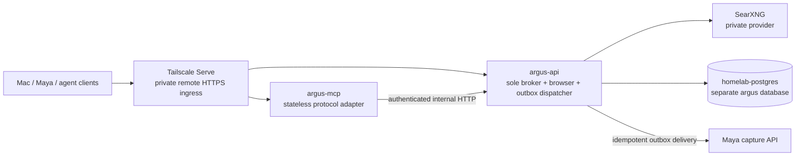
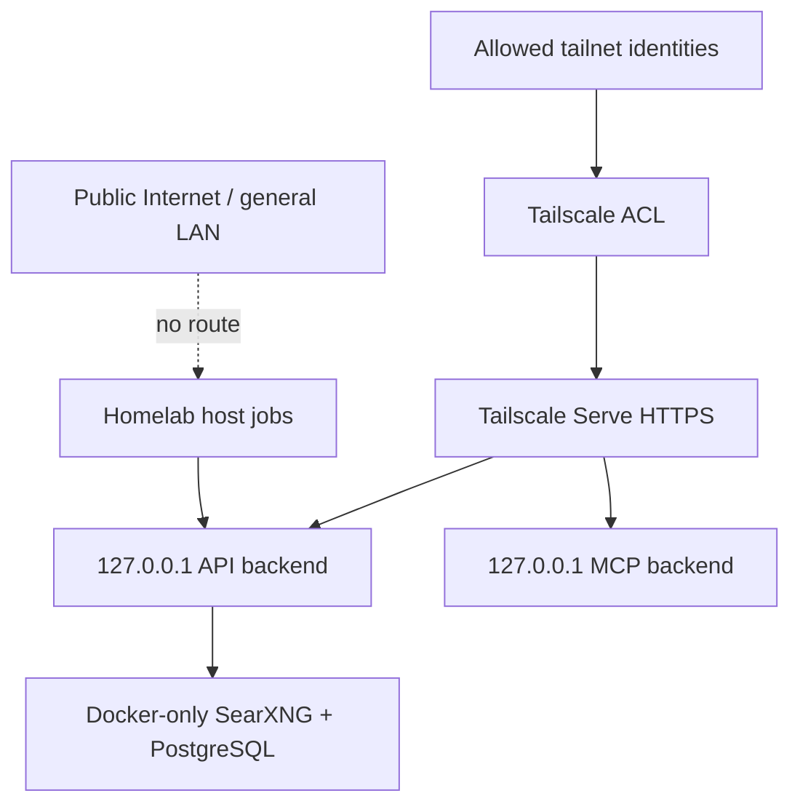

# 0002 — One private Argus authority on homelab

Date: 2026-07-22
Status: accepted
Supersedes: ADR-0001

## Context

The Mac launchd deployment and the two homelab containers each constructed
brokers, producing separate health, cooldown, cache, budget, and persistence
state. OCI still appeared in deployment, a host extraction service duplicated
container extraction, and ports `8270`–`8272` listened on every LAN interface.
The intended service is personal, private, and homelab-owned.

## Decision

Homelab Docker runs one production execution authority:

- `argus-api` is the only process that constructs `SearchBroker`. It owns
  provider clients, browser lifecycle, routing, health transitions, budget
  charging, persistence, and the restart-safe Maya outbox dispatcher.
- `argus-mcp` is a stateless streamable-HTTP adapter. It has no provider keys,
  database credential, browser, writable volume, or broker. Every tool call
  becomes an authenticated internal HTTP request to `argus-api`.
- SearXNG remains a separate homelab container on the Argus backend network. It
  has outbound Internet access but no LAN, tailnet, or public listener. A
  loopback-only compatibility port may exist only while direct legacy callers
  migrate to Argus.
- There are no production egress workers. Homelab already supplies residential
  egress and the supported browser capability. Retire
  `argus-residential.service`, remove `ARGUS_RESIDENTIAL_ENDPOINTS`, and rotate
  its exposed shared secret after the container extraction canary passes.
- The existing PostgreSQL 16 server becomes `homelab-postgres`, the shared
  database platform. Atlas and Argus use separate databases and least-privilege
  roles; neither can read or mutate the other's data. Keep `atlas-postgres` as a
  temporary DNS/container alias and loopback port compatibility path.
- PostgreSQL data stays on fast local storage. Generalized logical backups and
  cluster globals are copied outside the live data directory and verified by
  recurring isolated restores. Argus has no authoritative SQLite or JSON-file
  volume in production.
- SearXNG configuration is durable; its cache is disposable. Argus browser
  profiles, downloads, response caches, and temporary files are bounded,
  nonpersistent scratch. Docker logs rotate; durable operational history is in
  PostgreSQL.

## Private ingress

Docker publishes API and MCP backends on host loopback only. Argus is a private
service behind Tailscale: Tailscale Serve terminates HTTPS and is the only
remote ingress, while homelab components keep using internal paths:

Funnel and Cloudflare never route Argus. Tailscale identity is a network gate,
not application authorization: API and MCP still require scoped per-caller
credentials, caller attribution is derived from the credential, and the admin
credential is separate. Any future public ingress requires a new design.

Use a persistent Tailscale Serve configuration with automatic TLS and explicit
ACLs. The implementation may use the node HTTPS endpoint plus a second private
HTTPS port for MCP so neither backend needs subpath rewriting. Promotion must
verify `tailscale serve status`, the advertised URLs, the absence of Funnel,
loopback-only Docker publication, and rejection from a non-tailnet/LAN path.

## Development isolation

The Mac mini is a caller and development workstation, never a production
fallback:

- Maya and agent clients point to the homelab tailnet endpoints.
- Old Mac launchd Argus services are disabled after cutover.
- Local development brokers use SQLite, development identity, free/mock
  providers, disposable state, and nonproduction credentials.
- A developer who needs real providers calls production through a named,
  budget-capped HTTP credential instead of importing production secrets or
  connecting to production PostgreSQL.

## Consequences

MCP failure cannot split broker truth and can be restarted independently.
PostgreSQL, SearXNG, and browser facilities are not remotely addressable.
Loss of Tailscale blocks remote callers but leaves homelab-local operation,
outbox retries, and monitoring intact. Loss of SearXNG or the optional browser
degrades Argus; loss of PostgreSQL makes it unready for new durable work.
