# Deployment promotion, rollback, and runtime identity research

**Date:** 2026-07-22

**Wayfinder ticket:** [Define deployment promotion, rollback, and runtime
identity gates](https://github.com/Khamel83/argus/issues/30)

**Scope:** Planning evidence only. No production changes, paid-provider probes,
or deployment drills were performed.

## Decision

Production promotion should be a serialized, digest-addressed transaction:

1. GitHub Actions tests a commit, builds the production image once, pushes it to
   GHCR, and emits its exact manifest digest, source commit, OCI metadata,
   provenance attestation, and capability manifest.
2. A separate production job joins the tailnet as an ephemeral,
   least-privilege deployment identity and invokes one root-owned promotion
   command on the homelab. OCI is not in the path.
3. The homelab command verifies the attestation and digest, pulls that exact
   image, runs an isolated candidate stack, records the currently loaded and
   previous known-good digests, applies any compatible migration once, and
   replaces the sole production API authority in place.
4. Direct-loopback and actual Tailscale Serve checks prove startup, readiness,
   revision, search, extraction, MCP, durable accounting, and ingress behavior.
   Promotion remains provisional during a 30-minute soak.
5. Any blocking failure restores the exact previous digest and repeats the
   identity/readiness/canary gates. A release with a schema change that cannot
   safely run the previous image is not promotable without an explicit
   forward-repair recovery plan.

```mermaid
flowchart LR
    Commit["Tested Git commit"]
    Build["Build once"]
    GHCR["GHCR image@sha256 + attestation"]
    Runner["Ephemeral Tailscale deployer"]
    Promote["Homelab promotion lock"]
    Candidate["Isolated candidate gates"]
    Production["One production API authority"]
    Soak["30-minute tailnet soak"]
    Rollback["Previous exact digest"]

    Commit --> Build --> GHCR --> Runner --> Promote --> Candidate
    Candidate -->|"pass"| Production --> Soak
    Candidate -->|"fail before cutover"| Rollback
    Soak -->|"blocking failure"| Rollback
```



This is deliberately an in-place single-authority deployment, not a
two-production-broker blue/green design. A candidate may run before cutover
only with an isolated scratch database, no Maya dispatcher, no paid-provider
credentials, no production ingress, and a candidate identity. The brief
cutover downtime is compatible with the personal-production reliability
contract and avoids split budget, health, outbox, and browser ownership.

## Accepted constraints carried into this decision

- [The reliability contract](https://github.com/Khamel83/argus/issues/26#issuecomment-5053978717)
  requires truthful `ready`, `degraded`, and `unready` states; recovery from an
  unexpected process/container exit within five minutes; bounded search and
  extraction latency; RPO 0 for acknowledged durable records; the browser
  memory envelope; a restart drill; accounting reconciliation; loaded-revision
  proof; and a 30-minute promotion canary.
- [The browser capability contract](https://github.com/Khamel83/argus/issues/27#issuecomment-5054029879)
  requires a version-matched Playwright Chromium image, a 1 GiB initial
  production limit, browser concurrency one, and 20 sequential extraction
  canaries with zero OOMs, restarts, resets, or orphaned processes.
- [The production topology](https://github.com/Khamel83/argus/issues/29#issuecomment-5054190862)
  has one `argus-api` broker/browser/outbox authority, a stateless
  `argus-mcp` HTTP adapter, private SearXNG and PostgreSQL dependencies,
  loopback-only Docker publication, and Tailscale Serve as the only remote
  ingress.
- [OCI retirement](https://github.com/Khamel83/argus/issues/25#issuecomment-5053944190)
  removes OCI from deployment, readiness, fallback, and recovery.
- PostgreSQL is the production state authority. A stale backup is degradation
  for a code-only release and a blocker for a schema-changing release; a
  migration is not complete until a restored scratch database has passed the
  application read path.

## Current deployment is not a promotion gate

The checked-in workflow builds several mutable tags, then asks the homelab to
pull the Compose service name and restart it. It does not pass the build
digest, verify provenance, wait for readiness, check the loaded revision, run a
canary, retain a rollback digest, or prove rollback. The deploy command also
transits an OCI-labelled jump host and disables SSH host-key verification
([current workflow](https://github.com/Khamel83/argus/blob/f9aa1adaa219c80aef209b7e9b994333b37c3adc/.github/workflows/docker-publish.yml#L1-L73)).

The workflow references actions by movable major-version tags. GitHub says a
full-length commit SHA is currently the only immutable way to reference an
action and recommends least-privilege workflow permissions
([GitHub secure-use reference](https://docs.github.com/en/actions/reference/security/secure-use#using-third-party-actions)).

The current image also cannot prove the accepted browser contract: it is built
without the frozen `uv.lock`, lacks the required matching Chromium installation,
and has no baked source-revision/capability manifest
([current Dockerfile](https://github.com/Khamel83/argus/blob/f9aa1adaa219c80aef209b7e9b994333b37c3adc/Dockerfile#L1-L32)).

Read-only inspection on 2026-07-22 confirmed the resulting evidence gap:

| Surface | Current observation | Primary evidence |
|---|---|---|
| Host tools | Docker Engine 29.4.1, Compose 5.1.3, and Tailscale 1.98.4 | Version output on homelab |
| Loaded containers | API and MCP use the same locally resolved image digest, but neither was promoted from a recorded digest-addressed release | `docker inspect argus argus-mcp` |
| Image identity | The image has a full OCI source-revision label | `docker image inspect` |
| Runtime identity | The API health response reports package version `1.6.2`, but not the source revision, manifest digest, schema head, or capability inventory | Authenticated live health request |
| Recovery evidence | The API container reports restart count 12; no release record identifies the exact previous known-good image | `docker inspect argus` |
| Private ingress | Tailscale Serve and Funnel both report no configuration | `tailscale serve status`; `tailscale funnel status` |
| GitHub control | No `production` environment exists, and verification of the currently loaded digest finds no GitHub artifact attestation | GitHub first-party API; `gh attestation verify` |

The local image label is useful evidence, but it does not prove that the running
service, requested release, tested artifact, and recoverable prior release all
agree. The gates below close that chain explicitly.

## Why digest-addressed promotion is the minimum safe unit

A tag such as `latest`, `main`, or a semantic version is a useful discovery
name but not a deployment identity. GHCR documents pulling
`IMAGE@sha256:DIGEST` specifically to guarantee the same image version
([GitHub Container registry: pull by digest](https://docs.github.com/en/packages/working-with-a-github-packages-registry/working-with-the-container-registry#pulling-container-images)).
The OCI Image Specification defines
`org.opencontainers.image.revision` as the source-control revision identifier
and also standardizes source, version, and creation annotations
([OCI image annotations](https://github.com/opencontainers/image-spec/blob/main/annotations.md#pre-defined-annotation-keys)).

GitHub can attach build provenance to the exact container digest and later
verify it with `gh attestation verify oci://... -R Khamel83/argus`. For a
container image, the attestation action takes the fully qualified image name
without a tag and the build step's `sha256:` digest
([GitHub artifact-attestation generation and verification](https://docs.github.com/en/actions/how-tos/secure-your-work/use-artifact-attestations/use-artifact-attestations#generating-build-provenance-for-container-images)).

The release artifact should therefore be:

```text
ghcr.io/khamel83/argus@sha256:<manifest-digest>
```

Its build output must include:

- full Git commit SHA;
- image manifest digest;
- package/service version;
- OCI `source`, `revision`, `version`, and `created` metadata;
- supported Python and platform;
- frozen lock hash;
- schema head and the schema range accepted by this application revision;
- Playwright package version and bundled Chromium revision;
- expected production capabilities and resource profile.

Build provenance and an SBOM are useful supporting evidence, but neither
replaces runtime canaries. Docker documents that attestations describe how an
image was built and what it contains, and that registry-backed images can carry
max-level provenance plus an SBOM
([Docker build attestations](https://docs.docker.com/build/metadata/attestations/);
[Docker GitHub Actions attestation guidance](https://docs.docker.com/build/ci/github-actions/attestations/)).

## GitHub-to-homelab control path

Keep build/publish and production promotion as separate jobs or workflows.
Building a digest does not authorize it to replace production.

The production workflow should:

- run only for a tested commit/digest, through the `production` environment;
- use one `argus-production` concurrency group and never cancel a running
  deployment during cutover;
- pin every `uses:` action to a reviewed full commit SHA;
- grant only `contents: read`, `packages: write`, `attestations: write`, and
  `id-token: write` where the corresponding job actually needs them;
- use GitHub's `GITHUB_TOKEN` for the repository-linked GHCR push, not a
  long-lived broad package token;
- join the tailnet with Tailscale workload identity federation as an ephemeral
  `tag:argus-deployer` node;
- grant that tag only the deployment SSH path to the homelab, not PostgreSQL,
  SearXNG, the Docker socket, or general LAN access;
- use standard SSH over that tailnet connection initially, with a pre-pinned
  homelab host key and an environment-scoped deployment key restricted to one
  forced command;
- have that forced command invoke the fixed, root-owned promoter with the image
  digest and expected commit. The deployment identity does not receive an
  unrestricted shell, arbitrary `sudo`, or Docker-socket access;
- consider Tailscale SSH later if its host/user policy is deliberately adopted.
  Never restore `StrictHostKeyChecking=no` or trust a run-time `ssh-keyscan`
  result without an independent pinned key.

GitHub concurrency permits only one running job in a named group; production
must use that serialization without `cancel-in-progress: true`
([GitHub Actions concurrency](https://docs.github.com/en/actions/how-tos/write-workflows/choose-when-workflows-run/control-workflow-concurrency)).
Tailscale's official action supports GitHub-hosted runners, recommends workload
identity federation, creates a tagged ephemeral node, enforces the tag's access
rules, and removes the node after the workflow
([Tailscale GitHub Action](https://tailscale.com/docs/integrations/github/github-action)).

The homelab promoter adds a second host-local lock, such as `flock`, because a
manual recovery command and GitHub Actions must not race. Repeating promotion
of the already-loaded digest is idempotent and records a no-op; a different
digest waits or fails cleanly rather than overlapping.

## Gate sequence

### Gate 0 — Hermetic source and image CI

Before an image can be published as a candidate:

1. The lock/version consistency checks, compilation, and complete test suite
   pass on Python 3.11, 3.12, and 3.13.
2. Tests run with dotenv autoload disabled, no developer `.env`, no production
   secrets, and no fallback to machine-local services.
3. A production-like configuration validates one API authority plus a
   brokerless/keyless/DB-less/browserless/writable-volume-less MCP adapter.
4. The image is built from the frozen lock. The build fails unless the expected
   Playwright package and bundled Chromium revisions are both installed.
5. A network-free image command launches Chromium, renders a bundled marker,
   closes the context/browser/runtime, validates the schema compatibility
   manifest, and prints the baked build identity.
6. GitHub pushes once, captures the digest output, attaches provenance and an
   SBOM, and publishes no independent rebuilt “production” image.

Failure blocks publication or marks the digest ineligible. A passing source
suite against a different image is not evidence for the pushed digest.

### Gate 1 — Provenance and exact-image preflight on homelab

Before production is touched, the promoter:

1. validates the image reference is an allow-listed
   `ghcr.io/khamel83/argus@sha256:<64 hex>` reference;
2. verifies its GitHub attestation belongs to `Khamel83/argus`;
3. pulls that exact digest before stopping the current service;
4. confirms the local image's repository digest contains the requested
   manifest digest;
5. confirms its OCI revision equals the expected full commit;
6. confirms the embedded build/capability manifest agrees with the image label;
7. rejects a missing/mismatched browser inventory, schema range, architecture,
   or production capability;
8. records the actual currently running digest, local image ID, source
   revision, schema head, restart count, and last-known-good release before
   cutover.

This gate must derive “previous” from the running container and verified local
image, not from a tag or the last requested deployment.

### Gate 2 — Isolated candidate stack

Run the exact digest in a separate Compose project with:

- candidate node/deployment identity;
- a scratch database restored from a sanitized recent production backup or
  initialized at the current schema;
- no production ingress and host-loopback ports chosen only for the gate;
- no Maya dispatcher;
- free/local providers only and no paid-provider credentials;
- the production 1 GiB memory limit, browser concurrency one, init/reaping,
  shared-memory, shutdown-grace, and log limits;
- the real private SearXNG dependency where the test needs live residential
  search, plus deterministic local fixtures for non-network behavior.

The candidate must pass:

1. `/health/live`, `/health/startup`, and authenticated `/health/ready` with
   distinct semantics;
2. API auth rejection without/with an invalid credential;
3. MCP initialize, tool listing, one search, and one extraction through the
   stateless adapter;
4. known-answer free/local search with provenance, provider traces, zero paid
   credits, p95 at or below 15 seconds, and p99 at or below 30 seconds;
5. deterministic static and JS-rendered extraction fixtures with completeness
   and no silent truncation;
6. the maintained public extraction corpus with at least 90% accepted content,
   p95 at or below 30 seconds, p99 at or below 60 seconds, and every request
   ending explicitly within 90 seconds;
7. the issue #22 negative failed-launch regression at 512 MiB: 20 sequential
   attempts with the browser deliberately absent produce one bounded static
   capability failure and zero OOMs, restarts, resets, repeated runtime
   launches, or orphan Playwright processes;
8. the issue #22 browser-enabled 20-page sequential, single-worker run:
   zero OOMs, unexpected exits, restarts, connection resets, or orphan
   browser/Playwright processes; peak cgroup memory at or below 80% of 1 GiB;
   and RSS within 25% of pre-run RSS five minutes later;
9. request, provider-attempt, extraction, result, capture/outbox, usage, and
   budget reconciliation, with estimated usage kept distinct from
   provider-authoritative balances;
10. an abrupt API kill and an abrupt MCP kill after each has run longer than
   Docker's restart-policy activation threshold. Each returns to its required
   readiness within five minutes, with acknowledged records intact and a
   retried idempotency key producing one logical record;
11. a graceful termination during an in-flight browser request, proving that
    admission drains, the request terminates explicitly, and browser children
    are reaped inside the configured grace period.

Docker recommends measuring application memory needs and enforcing a hard
container limit; `docker stats` reports memory usage/limit and process counts
([Docker resource constraints](https://docs.docker.com/engine/containers/resource_constraints/);
[`docker stats`](https://docs.docker.com/reference/cli/docker/container/stats/)).
The gate should sample cgroup/Docker metrics continuously rather than relying
on a single post-run value.

Docker restart policies react to container exit, not to the semantic meaning of
an application health endpoint, and only take effect after the container has
been up successfully for at least ten seconds
([Docker restart policies](https://docs.docker.com/engine/containers/start-containers-automatically/)).
That is why the drill must wait for activation and actually kill the candidate
process/container.

### Gate 3 — Dependency-fault matrix

Run the following faults against the isolated candidate. Every observation must
include a bounded reason code, transition time, observation freshness, and
deployment/service-instance identity.

| Injected fault | Required result |
|---|---|
| SearXNG stopped | `degraded` while another supported free/local search path works; `unready` if no baseline search path remains |
| One optional provider unreachable | `degraded`; bounded same-request fallback; no global provider poisoning |
| Browser crash/disconnect | browser capability enters cooldown/unavailable and Argus is `degraded` while baseline HTTP extraction still works; no relaunch storm |
| Maya delivery unavailable | `degraded`; retrieval transaction and idempotent Maya outbox commit; backlog survives restart and drains exactly once logically after recovery |
| Provider balance refresh unavailable | `degraded`, observation marked stale; enforcement continues from the conservative local ledger |
| MCP adapter stopped | API remains ready; MCP surface is unavailable until its independent restart |
| PostgreSQL disconnected or made read-only | process remains live, Argus becomes `unready`, and new unsafe work is rejected without claiming durable acceptance |
| Outbox insert failure | `unready`; no user-visible retrieval is acknowledged without its capture record |
| API auth/config invalid | startup/readiness fail closed; no request path is admitted |
| All baseline search or extraction paths removed | `unready`; optional paid providers do not silently redefine the baseline |
| Tailscale unavailable | local API/outbox/monitoring continue, but canonical remote ingress fails and promotion cannot complete |

Docker's health status only becomes `unhealthy` after the configured
consecutive failures, and the check's exit code only records healthy/unhealthy
state
([Dockerfile `HEALTHCHECK`](https://docs.docker.com/reference/dockerfile/#healthcheck)).
An `unhealthy` healthcheck does not itself create an exit for the restart policy.
Therefore:

- the Compose healthcheck calls only the network-free `/health/live`;
- promotion separately polls `/health/startup` and authenticated
  `/health/ready`;
- an unready external dependency must not restart a live process;
- a true fatal internal condition exits cleanly or is recovered by an explicit
  liveness-only watchdog, never by a readiness watchdog.

### Gate 4 — Database and migration safety

For every release, compare the current database schema with the candidate's
accepted schema range before cutover.

For a code-only release:

- require the current schema to be in both the old and candidate accepted
  ranges;
- report backup freshness and last verified restore;
- permit an explicitly recorded degraded promotion if the ordinary backup is
  stale, but never conceal that state.

For a schema-changing release:

1. require a fresh Argus custom-format `pg_dump` and current cluster-globals
   backup outside the live data directory;
2. require `pg_restore --list` to parse the archive;
3. restore it into a disposable database with exit-on-error behavior;
4. run current-schema integrity/accounting checks;
5. apply the candidate migration to the scratch database;
6. run candidate readiness, read/write, accounting, and canaries there;
7. prove the previous image can still operate on the new schema, or designate
   the release as forward-only with an explicit operator-approved forward
   repair/restore procedure;
8. stop API/MCP admission, run the production migration exactly once under a
   deployment/migration lock, then start the candidate.

PostgreSQL 16 documents that `pg_dump` makes a consistent backup without
blocking readers or writers, that it covers one database while cluster globals
require `pg_dumpall`, and that custom archives support inspection and flexible
restore
([PostgreSQL 16 `pg_dump`](https://www.postgresql.org/docs/16/app-pgdump.html)).
`pg_restore --list` inspects the archive; `--exit-on-error` stops at the first
SQL error; and `--single-transaction` makes a compatible restore all-or-nothing
([PostgreSQL 16 `pg_restore`](https://www.postgresql.org/docs/16/app-pgrestore.html)).

Do not automatically run a production “down migration” during rollback.
Restore the previous application image only when its declared schema range
accepts the current database. Destructive data/schema recovery uses the
verified backup or a forward repair under an explicit incident procedure.

### Gate 5 — Controlled cutover

The promoter now:

1. takes the host-local deployment lock;
2. atomically writes a root-owned recovery record containing candidate,
   current, and previous verified digests plus source revisions and schema
   heads; it also records the deployment attempt in Argus's durable deployment
   ledger when PostgreSQL is available;
3. closes admission and allows bounded in-flight work/browser cleanup;
4. runs the already-validated migration once if required;
5. supplies the candidate digest reference to canonical Compose and runs the
   equivalent of:

   ```text
   docker compose pull argus-api argus-mcp
   docker compose up -d --no-build --wait --wait-timeout 300 argus-api argus-mcp
   ```

6. confirms the API and MCP ports are published only on host loopback and that
   SearXNG/PostgreSQL have no tailnet/LAN publication;
7. polls startup then authenticated readiness directly on loopback.

Compose's `--wait` waits for services to be running or Docker-healthy and
supports an explicit timeout
([`docker compose up`](https://docs.docker.com/reference/cli/docker/compose/up/)).
Because the container healthcheck is intentionally liveness-only, `--wait` is
necessary but not sufficient; the authenticated readiness poll is the
promotion decision.

The recovery record is deployment-controller state outside Argus's container
volumes, not a second application database. It exists so rollback still works
when PostgreSQL or Argus is unready. The same event and evidence are copied
into Argus's PostgreSQL deployment ledger for normal auditing.

### Gate 6 — Loaded-revision proof

Promotion must compare four layers and fail on any disagreement:

| Layer | Required evidence |
|---|---|
| Requested release | exact GHCR digest and expected full Git commit from the attested build |
| Local image | requested digest appears in the image's repository digests; local image ID; baked OCI revision/capability labels |
| Running container | container `.Image` equals the verified local image ID; configured image reference contains the requested digest; restart/OOM state is clean |
| Running application | authenticated admin status returns the baked source revision, package version, schema head/range, deployment ID, service-instance ID, Playwright/browser revisions, capability states, and expected digest |

The runtime build identity must be read from a file baked into the image, not
only from a Compose environment variable. The supplied expected digest may be
an environment value because a registry digest is not intrinsically known to
the process, but the promoter independently verifies it against Docker before
comparing it with the runtime report.

The stateless MCP adapter reports both its own baked revision and the upstream
API deployment identity. The gate requires the intended adapter revision and
the exact promoted API deployment identity; an MCP container talking to an old
or unexpected API fails.

Docker's `inspect` command returns detailed container information and supports
structured/templated output; OCI annotations provide the standardized source
revision field
([`docker container inspect`](https://docs.docker.com/reference/cli/docker/container/inspect/);
[OCI annotations](https://github.com/opencontainers/image-spec/blob/main/annotations.md#pre-defined-annotation-keys)).
The implementation should capture the complete machine-readable inspection
record, then render a sanitized summary rather than parsing `docker ps` text.

### Gate 7 — Canonical ingress and post-cutover canaries

Run the following through the actual Tailscale Serve HTTPS endpoints, not only
from inside Docker:

1. unauthenticated and invalid-key requests are rejected;
2. authenticated API readiness succeeds and reports the intended deployment;
3. MCP initialize/tool listing succeeds, followed by a free/local known-answer
   search through MCP;
4. an API known-answer search returns provenance/traces and spends zero paid
   credits;
5. one deterministic public extraction exercises the installed browser and
   returns complete content within the target;
6. a designated deployment canary proves the durable request/attempt/usage/
   budget/outbox transaction and idempotent retry without creating a normal
   user artifact;
7. the local loopback endpoint and advertised tailnet endpoint identify the
   same deployment;
8. `tailscale serve status --json` contains only the expected loopback
   backends; `tailscale funnel status` has no Argus configuration; LAN and
   non-tailnet access fail.

Tailscale Serve is explicitly tailnet-only, reverse proxies to a local backend,
supports JSON status, provisions TLS for HTTPS, and persists across restart
when configured in background mode
([Tailscale Serve CLI](https://tailscale.com/docs/reference/tailscale-cli/serve)).
Tailscale Funnel is the separate public-Internet feature and remains forbidden
for Argus.

### Gate 8 — Thirty-minute provisional soak

Promotion is not successful when the new process merely starts. For 30 minutes:

- sample authenticated API and MCP readiness every minute through Tailscale;
- require the intended deployment identity on every sample;
- run bounded search and extraction canaries at the defined cadence;
- require no connection reset, unexpected exit, OOM, restart-count increase,
  orphan browser process, migration drift, accounting gap, or outbox loss;
- require API cgroup memory at or below 80% of the 1 GiB hard limit and return
  to within 25% of the pre-canary RSS five minutes after the extraction run;
- require p95/p99 and 90-second extraction termination targets;
- permit only an explicitly enumerated optional-capability degradation, with
  its reason and freshness visible;
- keep the deployment workflow active and retain the previous image locally
  until the soak completes.

On success, mark the deployment `known_good`, preserve candidate/current/
previous identities in the deployment ledger, and garbage-collect only images
older than the retained rollback set. Keep at least the current and previous
known-good digests locally.

## Automatic rollback contract

A pre-cutover candidate failure leaves production untouched. A cutover or soak
failure automatically attempts application rollback when all of these are
true:

- the previous digest and source revision were verified from the pre-cutover
  running container;
- that exact image is still present locally or pullable by digest;
- its attestation remains valid;
- its declared schema range accepts the current schema;
- rollback does not require deleting or rewriting acknowledged records.

Rollback:

1. freezes new admission;
2. records the failed gate, candidate identity, current schema, and last
   verified durable offsets/counts;
3. reapplies the previous exact digest with `--no-build`;
4. runs the same loaded-revision, startup, readiness, direct/tailnet smoke,
   accounting, and restart/OOM checks;
5. keeps the failed digest for diagnosis and marks the prior release
   `restored`, not newly promoted.

If the previous image cannot accept the migrated schema, automation must not
guess. Keep Argus unready, retain durable state, and execute the predeclared
forward repair or verified database-restore incident procedure. This condition
should normally be prevented at Gate 4.

Rollback is itself unsuccessful until its loaded revision and canaries pass.
“Compose command exited zero” is not recovery evidence.

## Promotion blockers and permitted degradation

### Block promotion

- source/image tests are not hermetic or do not cover the pushed digest;
- action, image, provenance, digest, source revision, schema, or capability
  identity mismatch;
- mutable-tag deployment or an unverified/OCI-dependent control path;
- overlapping deployment or migration;
- missing browser binary/version, startup launch/render failure, or absent
  required capability;
- database/outbox/auth failure, incomplete migration, unverified required
  backup/restore, or unsafe schema rollback;
- no supported baseline search/extraction path;
- search/extraction latency or termination target missed;
- OOM, restart, reset, orphan, memory-headroom, or cleanup regression;
- unexplained accounting/deduplication gap or acknowledged-record loss;
- API/MCP loopback or canonical tailnet canary failure;
- unexpected public/LAN/Funnel exposure;
- loaded revision differs from the intended commit/digest;
- previous known-good image cannot be restored and no explicit forward recovery
  plan exists.

### Permit an explicitly degraded release

Only when the minimum path remains ready and every degradation is visible:

- one optional provider unavailable;
- direct Yahoo blocked on homelab;
- Maya delivery offline while the durable outbox remains writable and restart
  safe;
- provider-authoritative balance refresh stale while conservative local budget
  enforcement remains intact;
- browser deliberately disabled only for the already-approved emergency
  rollback profile, with reduced extraction capability reported truthfully;
- ordinary backup freshness stale on a strictly code-only, schema-compatible
  release. A schema change remains blocked.

## Rejected alternatives

### Pull and restart `latest`

Rejected. It cannot prove which manifest was tested or recover the prior
manifest after a tag moves.

### Rebuild on the homelab

Rejected. The deployed bits would not be the CI-tested, attested artifact, and
the production host would need build tooling and source-dependent network
resolution.

### Keep the OCI SSH jump host

Rejected by the no-OCI decision. The Tailscale deployment identity reaches the
homelab directly.

### Permanent privileged self-hosted GitHub runner

Rejected for the initial personal-production design. An ephemeral
GitHub-hosted runner with workload identity and a narrow Tailscale tag has less
persistent state and can invoke a constrained homelab-owned promoter without
mounting the production Docker socket into an Actions runner.
This repository is public, and GitHub recommends limiting self-hosted runners
to private repositories because fork-originated pull requests can execute
dangerous code on the runner host
([GitHub self-hosted runner access warning](https://docs.github.com/en/actions/how-tos/manage-runners/self-hosted-runners/manage-access#creating-a-self-hosted-runner-group-for-an-organization)).

### Two live production brokers for blue/green

Rejected. It conflicts with the single execution authority and would duplicate
browser, budget, cooldown, provider-health, and outbox ownership. An isolated,
non-dispatching candidate plus a short in-place cutover is sufficient for the
99.5% personal-production objective.

### Use Docker health as readiness and automatic restart

Rejected. Docker health records healthcheck outcomes, while restart policies
respond to container exit. Making dependency readiness the liveness check
would create misleading promotion evidence and invites restart storms when
PostgreSQL or another dependency is unavailable.

### Automatic down migration during rollback

Rejected. Application rollback and data recovery are different operations.
Use expand/contract-compatible schema evolution where possible; otherwise use
the declared forward repair or verified restore procedure.

## Implementation artifacts this decision implies

The implementation plan should create:

- a digest-producing, attesting image workflow with full-SHA action pins;
- a serialized production workflow using the Tailscale federated deployment
  identity and no OCI hop;
- one root-owned, locked, idempotent homelab promotion command;
- canonical Compose with digest injection, no production `build:`, loopback
  publication, liveness-only healthchecks, restart policy, resource/security
  controls, and separate migration/candidate profiles;
- a baked build/capability manifest and authenticated runtime identity report;
- startup/readiness/admin-status endpoints with the accepted semantics;
- deterministic and public search/extraction/MCP/accounting canary commands;
- dependency-fault and abrupt-restart drills for an isolated candidate;
- a deployment ledger plus minimal host-local recovery pointer;
- backward-compatible schema-range declarations and a one-shot migration lock;
- Tailscale Serve/Funnel/LAN exposure verification;
- automatic previous-digest rollback with the same post-rollback gates.

Implementation should remain split into small tickets, but none of these gates
is satisfied merely because the corresponding command exists. Each must emit
machine-readable evidence tied to the exact digest and deployment ID.
