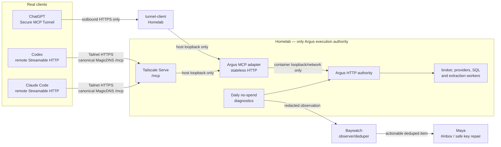

# Homelab Authority, Research Admission, and Repair Loop

**Status:** Proposed design — no implementation or deployment authorization

**Date:** 2026-08-23

**Decision owner:** parent Argus task, after review
**Scope:** Argus source, its Homelab deployment contract, and bounded integration contracts with Baywatch and Maya

## Decision in one page

Argus will have exactly one execution authority: the Homelab primary.  Every
real caller reaches that authority over an authenticated remote boundary.  The
canonical direct-client address is one MagicDNS HTTPS URL:

```text
https://homelab.deer-panga.ts.net/mcp
```

The precise hostname is an operator-owned configuration value, not a literal
to duplicate into code; the value above records the current intended naming
shape.  It is served by Tailscale Serve on the Homelab.  Tailnet callers do not
use a raw 100.x address, a port-specific alternate, or a localhost fallback.
Host/container loopback remains an internal Homelab-only hop.

The same `/mcp` endpoint supports both the MCP 2026-07-28 Streamable HTTP
protocol and correctly detected older `initialize`/session clients.  Codex and
Claude Code are direct Streamable HTTP callers.  ChatGPT uses an OpenAI Secure
MCP Tunnel whose `tunnel-client` runs on Homelab and is permitted to reach the
same private adapter; Argus has no public endpoint.

Research is admitted only when the result contains at least three usable,
deduplicated citations from at least two registrable domains.  A valid request
that does not meet that floor returns a structured
`insufficient_evidence` outcome, with the partial evidence and exact count,
instead of a plausible-looking answer.

Provider planning remains cost ordered but is no longer blind to stale
readiness.  It uses no-spend diagnostic observations plus bounded confidence
from prior relevant real queries.  An unknown balance is usable; a confirmed
exhaustion, cooldown, or configured disablement is not.  A real-query bakeoff
is allowed only at natural demand after confidence becomes stale, never as a
daily background spend.

Daily no-spend diagnostics emit redacted, bounded observations to Baywatch.
Baywatch observes and deduplicates.  Maya owns secret/API-key replacement and
creates actionable repair work in `#inbox`; no raw secret ever enters Argus
events, Baywatch, or Slack.

The visual README is deliberately outside this change.  It is regenerated only
after the implementation, full verification, production promotion, and client
proofs below are complete, immediately before the remote push.

## Evidence and truth boundary

This document distinguishes three kinds of statement deliberately:

| Class | What is established | What it does not establish |
|---|---|---|
| Primary source | The protocol and client behavior required by their authors. | That Argus or Homelab is configured that way. |
| Current source checkout | The code and tests in this worktree at `7b271744` (2026-08-23). | That the image, Tailscale Serve ingress, secret set, or a client is live. |
| Target | The approved state this design asks an implementation to create. | Permission to deploy it. |

No live service, Tailnet endpoint, secret, or client was probed for this
design.  Therefore this is not a current-health claim.  Historical operator
evidence can inform the gates below but must be re-run as part of promotion.

### Primary external sources

| Topic | Source-backed fact used by this design |
|---|---|
| MCP transport | The [2026-07-28 Streamable HTTP specification](https://modelcontextprotocol.io/specification/2026-07-28/basic/transports/streamable-http) uses one POST endpoint, requires `MCP-Protocol-Version` plus method/name headers for modern requests, permits JSON or request-scoped SSE responses, removes protocol sessions, and requires Origin validation. |
| Compatibility | [MCP versioning](https://modelcontextprotocol.io/specification/2026-07-28/basic/versioning) permits a single endpoint to serve modern and legacy eras; a modern client falls back only after inspecting a protocol-version error.  [Discovery](https://modelcontextprotocol.io/specification/2026-07-28/server/discover) is mandatory for modern servers. |
| Python SDK | The [Python MCP SDK v2 migration guide](https://py.sdk.modelcontextprotocol.io/migration/) documents the v2 break from `FastMCP` to `MCPServer` and auto discovery/fallback behavior.  The [legacy-client guide](https://py.sdk.modelcontextprotocol.io/run/legacy-clients/) documents serving both eras from one Streamable HTTP app. |
| Codex | [Codex MCP documentation](https://learn.chatgpt.com/docs/extend/mcp?surface=cli) documents direct remote Streamable HTTP configuration, bearer/OAuth credential references, and shared desktop/CLI/IDE configuration. |
| Claude Code | [Claude Code MCP documentation](https://code.claude.com/docs/en/mcp) recommends remote HTTP, accepts `streamable-http` as an alias for `http`, and deprecates SSE transport. |
| ChatGPT | [OpenAI Secure MCP Tunnels](https://developers.openai.com/api/docs/guides/secure-mcp-tunnels) documents an outbound `tunnel-client` on the private network forwarding MCP to private HTTP or stdio.  It requires a tunnel, runtime credential, private reachability, and OpenAI/ChatGPT association. |

### Current-source findings to preserve and reconcile

At the recorded checkout, source already pins `mcp==2.0.0`, uses
`MCPServer`, and has a `streamable_http_app(stateless_http=True)` adapter that
declares 2026-07-28 support.  `tests/test_mcp_stateless_v2.py` exercises a
modern header path and a legacy initialization path.  After a frozen install
of the `dev` and `mcp` extras, that focused test passed 4/4 in this worktree on
2026-08-23.  This is source-level evidence only.  This means the requested
SDK-v2 work is **not** a dependency bump to repeat.

It is still incomplete as an acceptance story:

1. Some test fixtures/import checks still expect `FastMCP` and `mcp==1.27.0`.
2. ADR 0006 and portions of client documentation still describe the former
   2025-era contract.
3. Source tests cannot prove the Homelab image, one canonical Serve route,
   direct Codex/Claude connection, or ChatGPT tunnel is using the source.

Scope 1 therefore treats SDK v2 as a source-reconciliation, compatibility-test,
and deployment-verification migration.  It does not assert that existing live
deployment is modern.

## Target architecture



### Invariants

1. `ARGUS_NODE_ROLE=primary` appears only on Homelab.  Mac mini, OCI, Codex,
   Claude Code, and tunnel-client are callers/adapters, never a local broker,
   provider executor, browser, or writable Argus database.
2. Real client configuration contains only the canonical HTTPS MagicDNS URL and
   an authentication reference.  It contains neither `localhost`, a raw
   tailnet IP, a container address, `ARGUS_DB_URL`, nor provider credentials.
3. One public-to-tailnet MCP path, `/mcp`, is the compatibility boundary.  The
   path does not split modern from legacy clients.  Its protocol branch is
   selected per request and cannot silently downgrade a valid modern request.
4. The adapter has only its scoped authority token.  Provider keys, database
   configuration, browser paths, and writable Argus volumes stay on the
   Homelab authority boundary.
5. A research synthesis can consume only an `admitted` result.  Partial
   retrieval is retained for diagnosis, but it is not promoted to an answer.
6. Routine diagnostics are no-spend by construction.  An actual search,
   extraction, paid probe, secret mutation, and deployment require their own
   explicit path and authority.

## Scope 1 — Homelab Authority and Modern MCP

### S1.1 Canonical endpoint and authority boundary

**Target.** Homelab exposes one Tailscale Serve HTTPS route at
`https://<homelab-magicdns>/mcp`.  Tailscale Serve forwards to a loopback-only
MCP adapter.  The adapter calls the Homelab HTTP authority over its internal
network.  Direct callers use that same single URL.  The ChatGPT tunnel-client
uses a loopback/internal URL only inside Homelab; it is never copied into a
client configuration.

The authority-side API may retain `/api/*` for caller adapters and operations,
but it is not a substitute MCP endpoint.  Tailscale Funnel/public ingress is
out of scope and must remain off.

**Client configuration contract (secret-free shape).**

```toml
# Codex: client-owned config; token value remains in its approved secret store.
[mcp_servers.argus]
url = "https://<homelab-magicdns>/mcp"
bearer_token_env_var = "ARGUS_MCP_CALLER_TOKEN"
enabled = true
```

```bash
# Claude Code: remote HTTP, not a local stdio server.
claude mcp add --transport http argus "https://<homelab-magicdns>/mcp" \
  --header "Authorization: Bearer \${ARGUS_MCP_CALLER_TOKEN}"
```

The exact secret-reference syntax is validated against the installed client
versions at cutover; neither command is an instruction to paste a secret into a
shell history.  If a client cannot express an environment/secret reference, it
is not admitted until the parent task chooses a supported secret mechanism.

### S1.2 MCP v2 compatibility contract

`/mcp` is one MCP Streamable HTTP endpoint with these explicit branches:

| Request era | Required behavior |
|---|---|
| 2026-07-28+ | Require matching `MCP-Protocol-Version`, `_meta.protocolVersion`, `Mcp-Method`, and applicable `Mcp-Name`; validate Origin and caller auth; support `server/discover`; do not issue or require an MCP session id. |
| 2025-11-25 and older | Accept only through the SDK's documented legacy compatibility path on the same URL; run `initialize` and session handling only where that era requires it. |
| Invalid/mixed | Return the protocol's clear 400/version-mismatch response.  Do not call the authority, create a session, or retry it as a different request. |

The response may be JSON or request-scoped SSE as the specification permits.
The compatibility test suite must parse both forms; a successful TCP/HTTP
connection alone is not protocol proof.  `stateless_http=True` is a serving
mode, not sufficient evidence that headers, discovery, and downgrade behavior
are correct.

### S1.3 SDK-v2 migration/reconciliation

The implementation begins with a compatibility inventory rather than blindly
changing dependencies:

1. Keep the existing `mcp==2.0.0` pin and lockfile as the target baseline.
2. Replace stale `FastMCP`/1.27 fixture assumptions with `MCPServer`/v2
   assertions, preserving one dedicated legacy-client test rather than a
   blanket legacy code path.
3. Supersede or amend ADR 0006 so it records the v2 contract, supported
   revisions, `server/discover`, header validation, and the one-endpoint
   compatibility rule.  A stale ADR must not remain a live design authority.
4. Remove client/provision examples that advertise raw 100.x URLs, local
   broker fallback, or direct client access to a container/loopback port.
5. Test the actual installed Codex and Claude Code versions against the remote
   candidate before declaring support; configuration creation is not a
   successful connection.

### S1.4 Scope-1 acceptance gates

Before a deployment is proposed, source must prove all of the following:

- A modern request reaches `server/discover`, `tools/list`, and an allowed
  tool call with 2026-07-28 headers and no `mcp-session-id` dependence.
- A legacy `initialize` client reaches the same `/mcp` path and completes only
  through the SDK compatibility branch.
- Version/header/body mismatch is an authenticated, bounded failure that never
  invokes the authority backend.
- Origin and caller authentication fail closed; logs/receipts do not contain a
  bearer token.
- Caller-only configuration cannot instantiate a local broker or receive
  provider/DB settings.

Deployment then re-runs those checks over the one MagicDNS HTTPS URL with
separate direct Codex, direct Claude Code, and tunnel-client paths.  A raw IP,
`:8000`, `:8443`, or `localhost` success is diagnostic-only and cannot pass the
client acceptance gate.

## Scope 2 — Research Admission and Provider Confidence

### S2.1 Research admission contract

Add a versioned, research-specific result contract rather than silently
changing legacy discovery search semantics or the exact existing HTTP-v2
envelope.  The target HTTP route is `POST /api/research`; its MCP equivalent is
`research_web`.  Both call the same authority workflow and return the same
structured admission object.

```json
{
  "contract_version": "research-admission-1",
  "request_id": "opaque-id",
  "outcome": "insufficient_evidence",
  "research_admission": {
    "minimum_usable_citations": 3,
    "minimum_distinct_domains": 2,
    "usable_citation_count": 2,
    "distinct_domain_count": 2,
    "missing": ["usable_citations"]
  },
  "citations": [
    {
      "url": "https://example.org/source",
      "title": "Bounded title",
      "domain": "example.org",
      "provider": "provider-id",
      "source_type": "search",
      "egress": "unknown"
    }
  ],
  "error": {
    "code": "insufficient_evidence",
    "message": "Research admission requires 3 usable citations across 2 domains."
  }
}
```

`error` is null only for `admitted`.  `insufficient_evidence` is a first-class,
machine-readable outcome, not a free-text warning or an empty-result alias.
HTTP returns 422 for it with the partial evidence body; the MCP tool returns an
error result whose structured content is this object.  This makes downstream
synthesis fail closed while preserving diagnostic evidence.  The route's
`research-admission-1` contract is intentionally separate from the exact
HTTP-v2 envelope, so adding this outcome does not broaden an existing closed
v2 enum.  A transport, validation, or authority failure returns `failed`, not
`insufficient_evidence`.

A citation is *usable* only if it has a valid canonical public HTTP(S) URL,
nonempty bounded title, a registrable domain, and survived the normal result
dedupe/quality rules.  Count unique canonical URLs, then count registrable
domains.  Multiple subdomains of the same registrable domain count once.
Blocked/error pages, malformed URLs, provider metadata, and duplicates never
count.  The admission receipt preserves no page body or query content beyond
the normal request retention policy.

The workflow may return more than three citations.  It cannot claim an
admitted research answer with fewer than three usable citations across two
domains, even if one provider returned a confident snippet.

### S2.2 Provider confidence model

Provider readiness remains the source of truth for deterministic exclusion:
configured/disabled, capability, reachability, health, cooldown, and a
confirmed exhausted balance.  Provider confidence is an additional,
expiring ranking signal; it never converts a failed or disabled provider into
an eligible one.

Persist a bounded `ProviderConfidenceV1` record per
`(provider, request_class, egress_scope)`:

| Field | Meaning |
|---|---|
| `provider`, `request_class`, `egress_scope` | Stable routing key; no credential identifier. |
| `diagnostic_state`, `diagnostic_observed_at`, `diagnostic_expires_at` | Most recent no-spend observation and freshness. |
| `real_query_successes`, `real_query_insufficient`, `real_query_failures` | Bounded rolling outcomes for relevant authorized traffic. |
| `citation_yield`, `domain_yield` | Aggregate admitted-evidence yield, never raw result text. |
| `last_relevant_query_at`, `confidence_state`, `confidence_expires_at` | Durable confidence with an explicit stale state. |
| `balance_state` | `unknown`, `available`, `confirmed_exhausted`, or `not_applicable`; unknown remains eligible. |
| `reason_codes` | Small redacted enum set suitable for Baywatch. |

The database stores neither a provider API key nor a raw balance response in
this model.  Existing provider readiness/spend repositories are extended by a
forward migration; a failed migration is a rollout stop, not an opportunity to
recreate a local caller database.

### S2.3 Routing and spend policy

For each research request, the planner operates in ordered stages:

1. eligible free/unlimited or renewable capacity;
2. eligible recurring monthly capacity;
3. eligible prepaid/one-time capacity only after stage 1 and 2 supply no
   admissible evidence or the request declares a provider capability that is
   genuinely required;
4. structured `insufficient_evidence` when no authorized stage produces the
   3-citation/2-domain floor.

Within a stage, sort by relevant, nonstale confidence, then normal routing
score and topology.  A stale or unknown confidence does not exclude a provider;
it is tried conservatively in the stage.  Unknown balance likewise does not
exclude.  Confirmed exhaustion, a health cooldown, explicit disablement, or a
caller tier cap does.

A *bakeoff* is not a cron job.  On an authorized real research request, only
when a provider's relevant confidence is stale and normal lower-cost attempts
did not admit the request, the planner may compare the smallest eligible set
needed to resolve routing uncertainty.  It obeys the request's normal budget,
caller tier cap, timeout, and result cap, records aggregate yield, and stops
as soon as admission succeeds.  It never uses paid/prepaid capacity merely to
refresh a metric.

### S2.4 Scope-2 acceptance gates

- Unit tests cover 3 URLs/2 domains admitted, 2 URLs/2 domains rejected, 3
  URLs/1 domain rejected, canonical duplicate collapse, and malformed/blocked
  result exclusion.
- HTTP and modern/legacy MCP surfaces expose the same count, outcome, and
  safe partial citations for every fixture.
- A planner test proves unknown balance remains eligible, confirmed exhausted
  does not, and higher tiers are untouched when lower tiers admit evidence.
- A real-query test fixture proves stale confidence causes a bounded,
  demand-triggered bakeoff only after lower tiers are insufficient; no daily
  diagnostic path calls provider search or extraction.
- Persistence migration, downgrade/read compatibility, retention bounds, and
  concurrent request behavior pass against the production database engine in a
  disposable candidate environment.

## Scope 3 — Operations and Repair Loop

### S3.1 No-spend daily diagnostics

The Homelab authority runs one daily `provider-diagnostics` job.  It invokes
only the existing no-spend configuration/readiness probes: configuration
presence, disabled/cooldown state, safe metadata/capability checks where a
provider explicitly supports them, and previously persisted balance/readiness
facts.  It does **not** issue `search`, `extract`, browser, index, or paid
canary work.

Every run creates bounded `ArgusProviderObservationV1` records and posts them
to Baywatch:

```json
{
  "schema_version": "argus-provider-observation-1",
  "observation_id": "opaque-id",
  "observed_at": "RFC3339",
  "expires_at": "RFC3339",
  "provider": "brave",
  "dimension": "credential | configuration | capability | reachability | cooldown | balance",
  "state": "healthy | unknown | degraded | failed | skipped",
  "reason_code": "credential_rejected | configuration_missing | quota_exhausted | provider_contract_drift | transient | none",
  "repair_owner": "maya | argus | none",
  "safe_summary": "credential rejected; rotation needed",
  "release_id": "opaque-version"
}
```

`safe_summary` is length-limited and linted: no Authorization header, API key,
token-like string, provider response body, query, URL parameters, or raw
balance amount.  The job emits a self-observation if it cannot post to
Baywatch, rather than fabricating provider failures.

### S3.2 Ownership and repair contract

| Actor | Owns | Must not own |
|---|---|---|
| Argus | no-spend observation, readiness/confidence facts, redacted receipt, local safe remediation guidance | provider-key value, Slack notification policy, secret rotation |
| Baywatch | observation ingestion, freshness, deduplication, active incident view | provider execution, secret validation/replacement, retry-spending |
| Maya | safe API-key configuration/replacement process and creation of concrete `#inbox` repair work | exposing raw credentials in a task or granting broad standing provider access |
| Human operator | Tailscale/OpenAI permissions, secret authority, spend authorization, production promotion/rollback | delegating a raw secret through Baywatch/Slack |

Baywatch opens one deduplicated active condition by stable provider/dimension/
reason-code key and expiry window.  Maya turns only actionable, non-transient
conditions into a bounded inbox item that names the provider, reason code,
observed time, affected capability, and safe remediation class.  It does not
include a key, balance amount, or customer query.  Resolved observations close
only when a fresh no-spend observation confirms them; a transport receipt from
Slack or Baywatch is not provider health.

### S3.3 Operational acceptance and rollback

The rollout has explicit stopping points:

| Gate | Evidence required to proceed | Rollback if it fails |
|---|---|---|
| Source candidate | deterministic source tests, migration rehearsal, and no stale v1 contract assertions | do not build/deploy; keep data schema unchanged |
| Homelab candidate | authority healthy locally, Tailscale Serve exposes only the canonical route, unauthenticated client gets 401/403, modern and legacy authenticated protocol tests pass | restore previous image/config and Serve mapping; preserve DB for forward-only migration recovery |
| Direct clients | installed Codex and Claude Code each list/connect/use one harmless tool through canonical URL | remove their new configuration, retain previous known configuration only if it was separately approved |
| ChatGPT tunnel | tunnel health/readiness plus ChatGPT tool scan and harmless call reach private adapter | revoke/disable tunnel association/runtime key and stop tunnel-client; leave Argus non-public |
| Research/provider | synthetic admission suite and authorized low-cost real-query bakeoff yield structured receipts | disable research-admission route/tool; retain old discovery search behavior and confidence observations |
| Repair loop | daily run reaches Baywatch, duplicate condition yields one action, safe-summary secret scanner passes | stop timer/event publisher; keep provider execution policy unchanged |

A downgrade of an already-applied database migration is not assumed safe.  The
implementation must take the database's normal verified backup/snapshot before
the forward migration and use a forward repair unless an explicitly tested
downgrade exists.  Rolling back code must not make a caller become a local
broker.

## Practical phases and human authority gates

### Phase A — source reconciliation (no production change)

Implement and test the SDK-v2 reconciliation, exact client configuration
templates, research admission contract, confidence model, and operations
payloads in an isolated development environment.  Do not regenerate the visual
README and do not publish a remote branch yet.

### Phase B — candidate deployment preparation

Build an immutable Homelab candidate and rehearse forward migration and
rollback using a disposable/candidate database.  Prepare, but do not apply,
the Tailscale Serve, system service, tunnel-client, Baywatch, and Maya changes.
Use secret references only; inspect neither raw values nor full environments.

### Phase C — authorized production promotion

After the human gates below, promote the Homelab candidate, run the single
canonical HTTPS protocol matrix, then configure Codex and Claude Code.  Create
and associate the OpenAI tunnel only after direct authority behavior is proven.
Run one bounded real research request under normal cost policy; verify
admitted and insufficient-evidence outcomes independently.

### Phase D — operational proof and final artifact

Enable the daily no-spend diagnostic timer, prove one redacted deduped repair
cycle, and let it survive one freshness interval.  Only then regenerate the
visual README/overview as the final artifact, verify it against the deployed
contract, commit it, and push the reviewed branch.

### Remaining human-only authority

1. Approve the exact Homelab MagicDNS name and Tailscale Serve route, and apply
   its host/service configuration.  This task has not done so.
2. Supply/authorize the scoped caller-token references for Codex and Claude
   Code without exposing their values to source control or command history.
3. Create/associate the OpenAI Secure MCP Tunnel and its runtime credential;
   enable the required ChatGPT developer-mode/workspace permissions and decide
   whether the app is private or published.  These are account-admin actions.
4. Authorize Maya's safe provider-key update path and any actual replacement
   of provider API keys.  Argus/Baywatch must receive only success/failure
   facts, never the key.
5. Approve any real-query bakeoff that could consume recurring or prepaid
   capacity beyond the requester's ordinary budget, plus the production
   promotion window and rollback authority.
6. Approve final visual README regeneration and remote publication only after
   all previous evidence is attached to the implementation review.

## Out of scope

- Code, container, systemd, Tailscale, OpenAI, Baywatch, Maya, secret, or
  provider-account changes in this design task.
- A public Argus endpoint, Funnel, a second client endpoint, or client-side
  local fallback.
- A daily paid search/extraction canary or automated key rotation.
- Rebuilding the visual README before implementation and operational proof.

## Design-review questions for the parent task

The settled decisions answer the architecture questions.  The parent review
only needs to decide the implementation authorization and precise operator
values that cannot safely be inferred: canonical host ownership, approved
caller-token secret references, production window/rollback owner, and OpenAI
tunnel/workspace administrator.  No source code should be started until that
review accepts the staged plan in the companion file.
